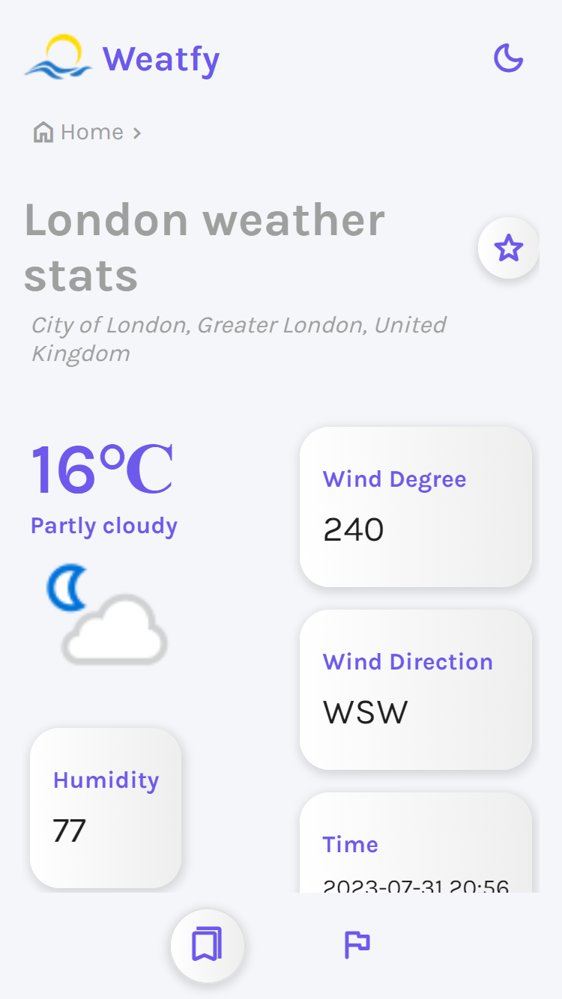
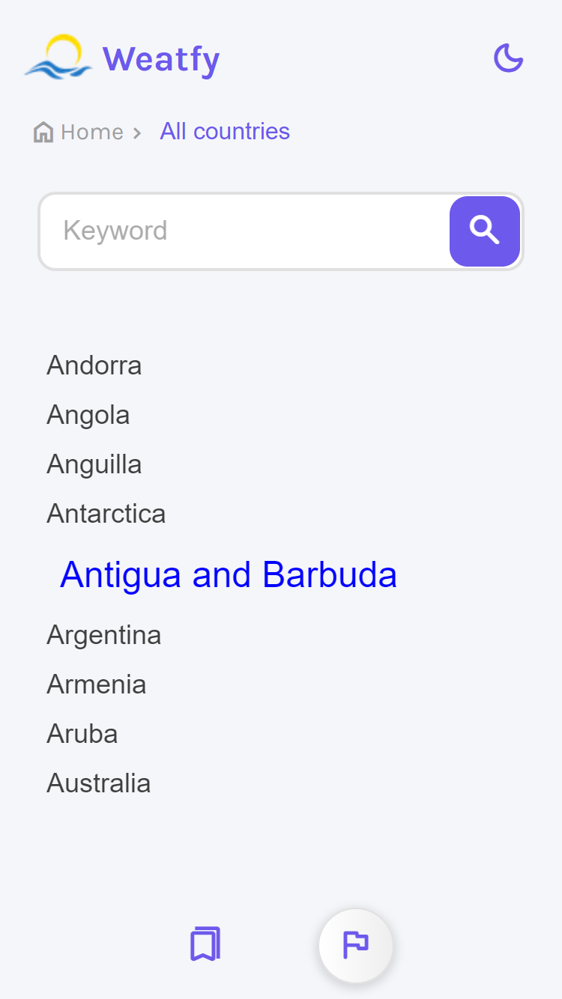
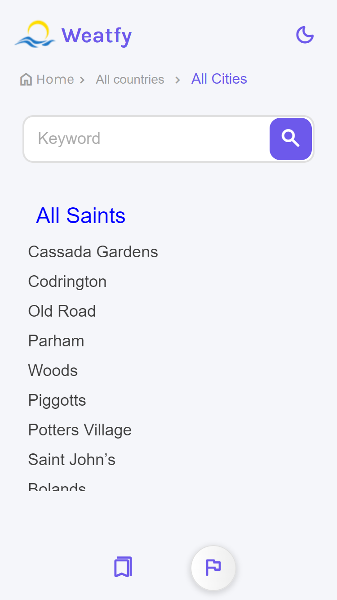
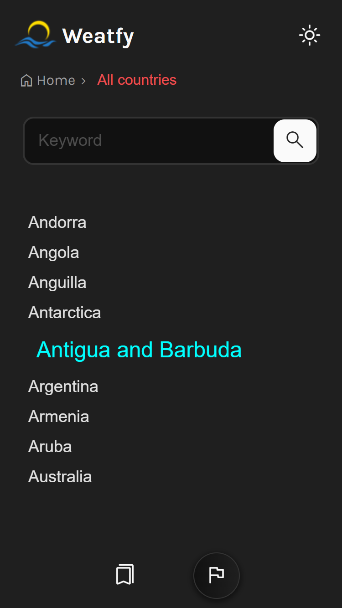
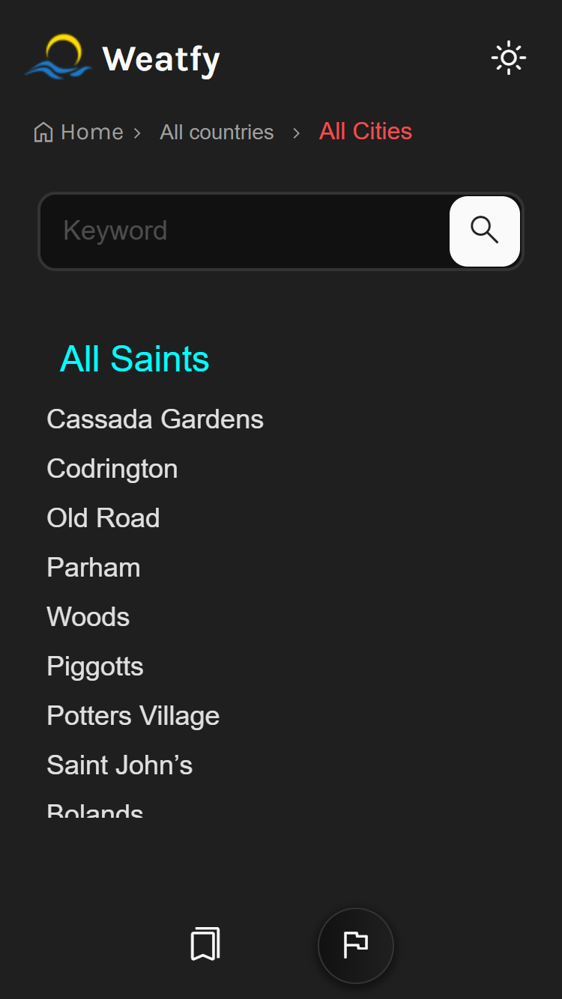
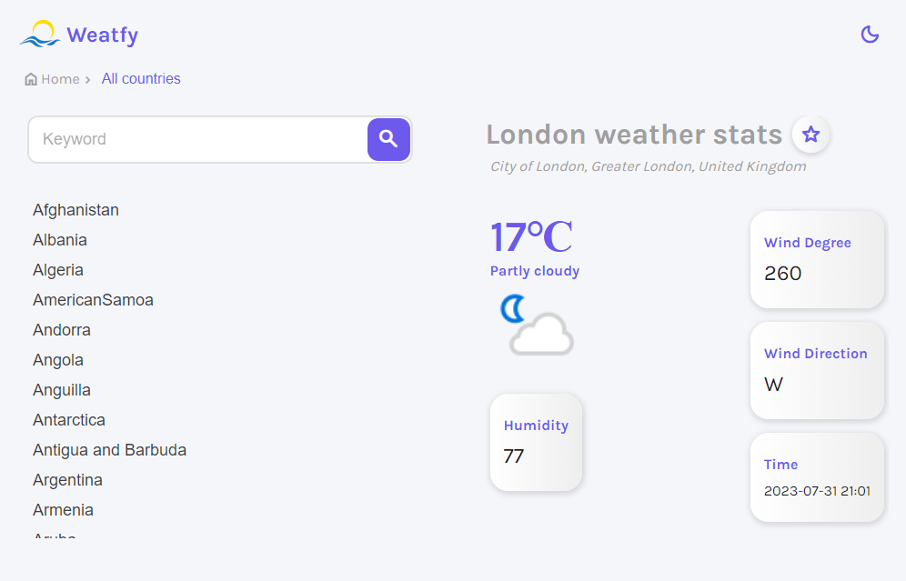
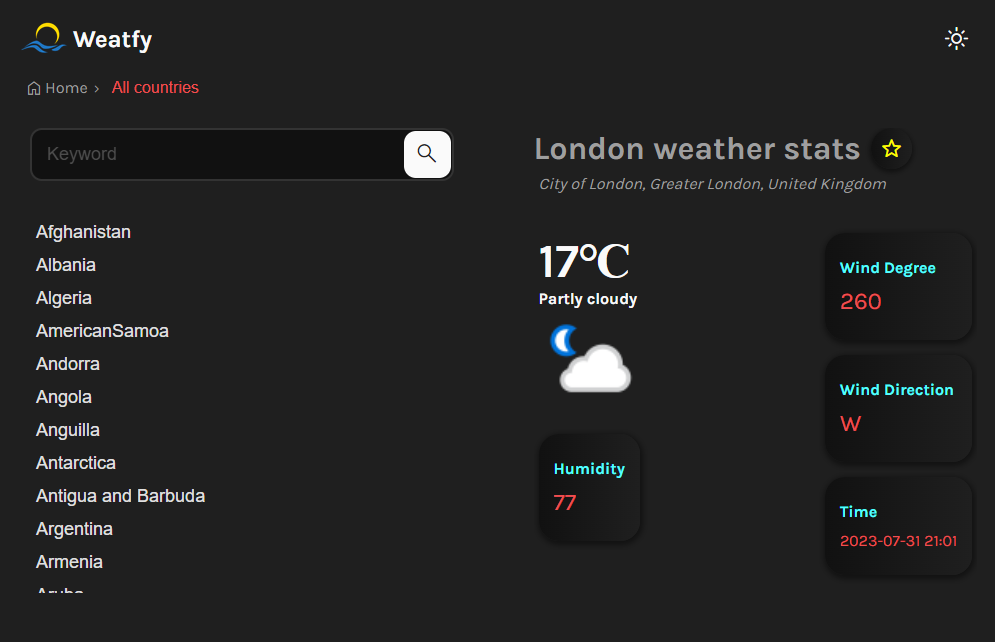

# Weatfy ~ Weather App

Weatfy is a weather app that allows users to check current weather stats of any city in the world. Users can view different cities and choose which one at a time to check for weather stats.

## 🛠️ Built With

- APIs

## Screenshots

<table>
  <tr>
    <td>
      
    </td>
    <td>
      
    </td>
    <td>
      
    </td>
  </tr>
  <tr>
    <td>
      
    </td>
    <td>
      
    </td>
    <td>
      
    </td>
  </tr>
</table>
<table>
  <tr>
    <td>
      
    </td>
    <td>
      
    </td>
  </tr>
</table>

## Authors

👤 **Steven Ntakirutimana**

- GitHub: [@sntakirutimana72](https://github.com/sntakirutimana72)

## 🤝 Contributing

Contributions, issues, and feature requests are welcome!

Feel free to check the [issues page](../../issues/).

## 🫶 Show your support

Give a ⭐️ if you like this project!

## 🤓 Acknowledgments

- `WeatherApi.com`
- `getpostman.com`

## 📝 License

This project is [MIT](./LICENSE) licensed.
